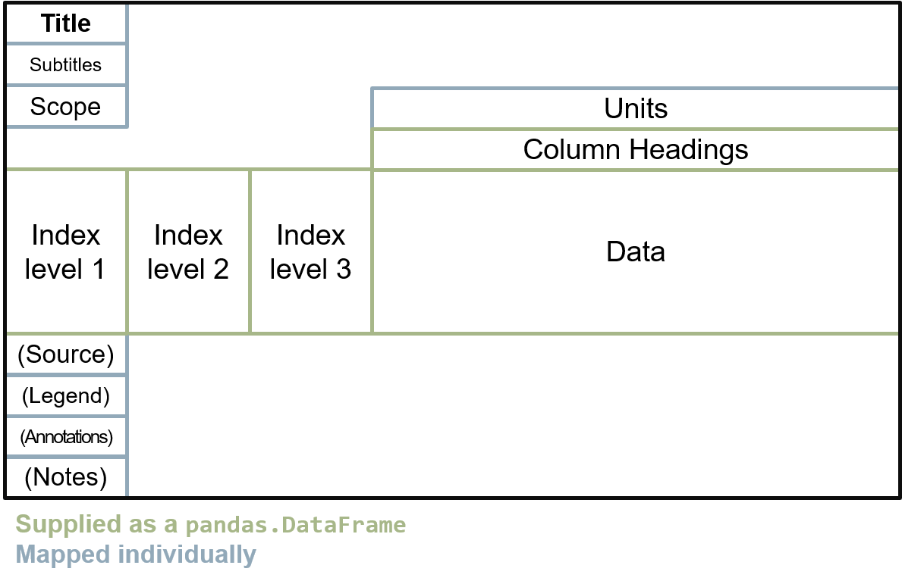

*******************************
Good Practice Tables (gptables)
*******************************

.. image:: https://github.com/best-practice-and-impact/gptables/workflows/continuous-integration/badge.svg
    :target: https://github.com/best-practice-and-impact/gptables/actions
    :alt: Actions build status

.. image:: https://badge.fury.io/py/gptables.svg
    :target: https://badge.fury.io/py/gptables
    :alt: PyPI release

``gptables`` produces `.xlsx` files from your ``pandas`` dataframes in
either python or R (using reticulate_). You define the mapping from your
data to elements of the table and ``gptables`` does the rest.

.. _reticulate: https://rstudio.github.io/reticulate/

Table element mapping:

thin the same row on a new line under the units. In columns 1, 2 and 3 of the next row down are index levels 1, 2 and 3. In the next columns are the data. Column headings, indices and data are supplied as a pandas DataFrame. Units and table note references are mapped individually.

``gptables`` uses the official `guidance on good practice spreadsheets`_.
It advocates a strong adherence to the guidance by restricting the range of possible operations.
The default formatting theme ``gptheme`` accommodates many use cases.
However, the :class:`~.core.theme.Theme` Class allows development of custom themes, where alternative formatting is required.

``gptables`` is developed and maintained by the `Analysis Function`_.

.. _`guidance on good practice spreadsheets`: https://analysisfunction.civilservice.gov.uk/policy-store/releasing-statistics-in-spreadsheets/

.. _`Analysis Function`: https://analysisfunction.civilservice.gov.uk/

5 Simple Steps
--------------

1. You map your data to the elements of a :class:`~.core.gptable.GPTable`.

2. You can define the format of each element with a custom :class:`~.core.theme.Theme`, or simply use the default - gptheme.

3. Optionally design a :class:`~.core.cover.Cover` to provide information that relates to all of the tables in your Workbook.

4. Optionally upload a ``notes_table`` with information about any notes.

5. You :func:`~.core.api.write_workbook` to win.

.. toctree::
   :maxdepth: 2
   :hidden:
   
   doc.api.rst
   usage.rst
   doc.gptable.rst
   doc.theme.rst
   doc.cover.rst
   doc.wrappers.rst
   checklist.rst
   changelog.rst
   
